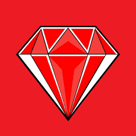
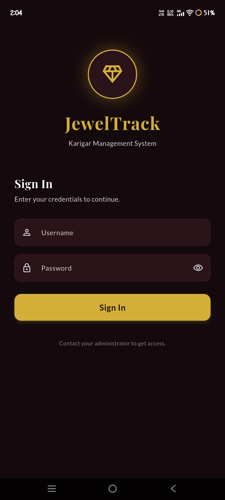
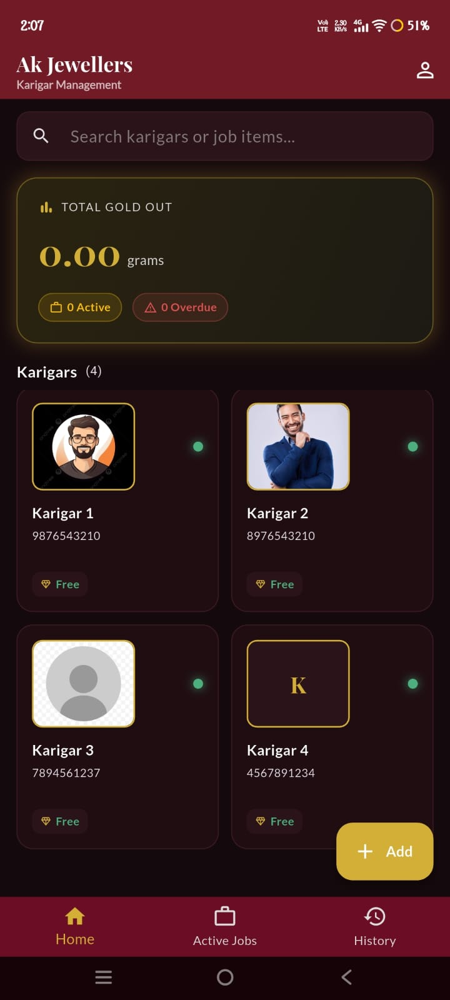
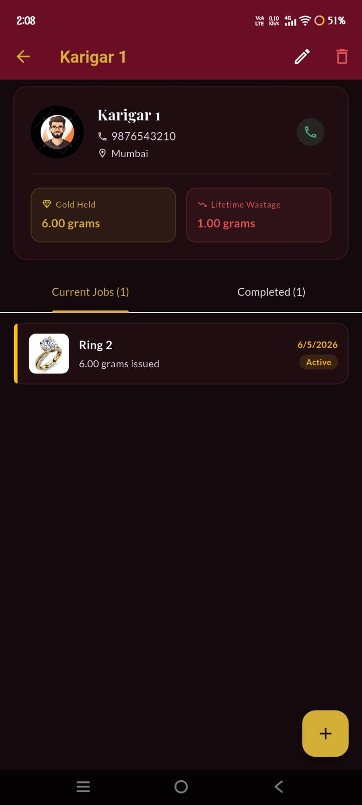
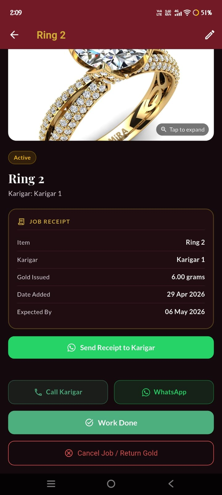
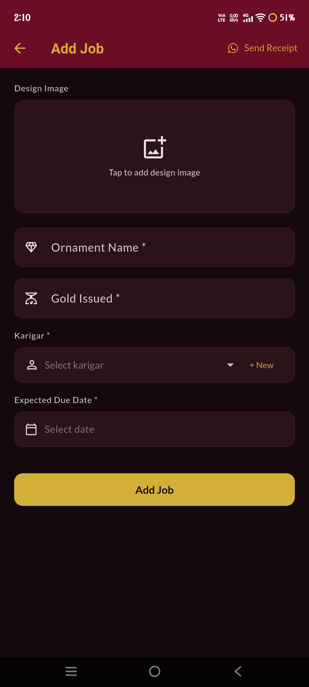
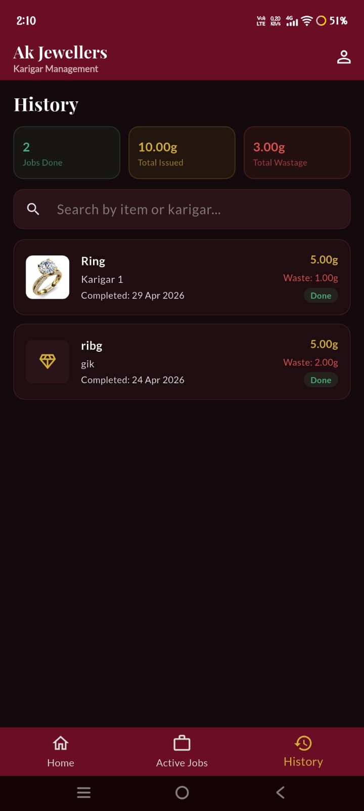

<div align="center">



# JewelTrack 💎

**Karigar Management App for Indian Jewellery Shop Owners**

*Track gold. Manage craftsmen. Never lose a gram.*

[](https://flutter.dev)
[](https://dart.dev)
[](https://isar.dev)
[](https://riverpod.dev)
[](LICENSE)
[](CONTRIBUTING.md)

</div>

---

## 📖 Overview

JewelTrack is a **local-first**, production-grade Flutter app built specifically for Indian jewellery shop owners. It solves the everyday problem of tracking gold given to karigars (craftsmen) — how much was issued, when it's due back, and how much gold was lost as wastage.

No spreadsheets. No paper ledgers. No internet required.

> **Built for Indian jewellers** — WhatsApp reminders, grams as the universal unit, and a workflow designed around how Indian jewellery shops actually operate.

---

## 📱 Screenshots

<div align="center">

| Login | Home | Karigar Detail |
|:---:|:---:|:---:|
|  |  |  |
| *One-time shop setup* | *Gold summary + karigar grid* | *Jobs, metrics & gold held* |

| Job Detail | Add Job | History |
|:---:|:---:|:---:|
|  |  |  |
| *Design image, actions & work done* | *Photo, weight, karigar & date* | *Searchable completed jobs* |

</div>

---

## ✨ Features

### 🏠 Home Screen
- **Total Gold Out** — Live summary card showing all gold currently with karigars in grams
- **Karigar Grid** — Cards with real-time status dots: 🟢 Free · 🟡 Active · 🔴 Overdue
- **Universal Search** — Search by karigar name *or* job item (search "ring" to find all ring jobs)
- Quick-add FAB for new karigars or new jobs

### 👨‍🔧 Karigar Management
- Add karigars with name, phone, address, and optional profile photo
- **Gold Held** — live total of gold in a karigar's possession
- **Lifetime Wastage** — cumulative gold lost across all completed jobs
- Tabbed view: Current Jobs / Completed Jobs
- Delete karigar (blocked if they have active jobs — data safety)
- Edit all karigar details at any time

### 💼 Job Management
- Assign jobs with ornament name, gold weight (grams), design photo, expected due date
- **Design image capture** — take photo on the spot or pick from gallery
- **Share Receipt** — send a text summary + design image via WhatsApp, Gmail, or any app
- Edit jobs anytime while active; once complete, only received weight can be changed

### ✅ Work Done Flow
1. Tap **Work Done** on any active job
2. Enter **Gross Weight** (total ornament weight) and **Net Gold Weight** (excluding stones)
3. App calculates wastage automatically
4. Confirmation dialog before submitting
5. Job moves to history with full record

### 📞 Communication
- **Call** karigar directly from the job detail screen
- **WhatsApp Reminder** — pre-filled message with item name, weight, due date, and shop name
- Overdue jobs display the WhatsApp button prominently in red

### 🔄 Cancel Job / Return Gold
- Cancel any active job to return gold to the shop's available pool
- No wastage is recorded for cancelled jobs — gold is simply returned

### 📜 History
- Searchable log of all completed jobs across all karigars
- Stats bar: total jobs done, total gold issued, total wastage
- Search by item name or karigar name

### 🔐 Backup & Restore
- **One-tap backup** — creates a `.zip` containing the Isar database and all images
- Share via WhatsApp, Google Drive, Gmail — anything
- **Restore** — pick a `.zip` on a new device to recover all data instantly
- Fully offline — no cloud account needed

### 👤 Profile
- Edit shop name, owner name, and mobile number at any time
- Clean settings screen for backup/restore operations

---

## 🧮 Gold Wastage Formula

```
Wastage (grams) = Issued Weight − Net Gold Weight
```

| Term | Definition |
|---|---|
| **Issued Weight** | Grams of gold given to karigar for the job |
| **Gross Weight** | Total weight of finished ornament (including stones) |
| **Net Gold Weight** | Weight of gold only in the finished ornament (excluding stones) |
| **Wastage** | Gold consumed/lost during the making process |

---

## 🛠 Tech Stack

| Layer | Technology |
|---|---|
| **Framework** | Flutter 3.x |
| **Language** | Dart 3.x |
| **Database** | [Isar](https://isar.dev) — ultra-fast embedded NoSQL, local-only |
| **State Management** | [Riverpod](https://riverpod.dev) — `StateNotifier` + derived providers |
| **Image Handling** | `image_picker` + `flutter_image_compress` via background `Isolate.run()` |
| **Communication** | `url_launcher` for `tel:` and `https://wa.me/` deep links |
| **Sharing** | `share_plus` for receipt sharing with images |
| **Backup** | `archive` package — ZIP of DB + images folder |
| **File Restore** | `file_picker` for selecting `.zip` backup files |
| **Fonts** | Google Fonts — Playfair Display (headings) + Lato (body) |
| **Date Formatting** | `intl` package |

---

## 📁 Project Structure

```
lib/
├── main.dart                           # App entry, theme, auth routing
│
├── models/
│   ├── shop_profile.dart               # Isar: shop owner record
│   ├── karigar.dart                    # Isar: karigar records
│   └── job.dart                        # Isar: job records + wastage calc
│
├── providers/
│   └── app_providers.dart              # All Riverpod state (karigars, jobs, search)
│
├── screens/
│   ├── login/
│   │   └── login_screen.dart           # One-time setup screen
│   ├── home/
│   │   └── home_screen.dart            # Summary card, karigar grid, search
│   ├── karigar/
│   │   ├── karigar_detail_screen.dart  # Profile + tabbed job lists + metrics
│   │   └── add_karigar_screen.dart     # Add / Edit karigar form
│   ├── job/
│   │   ├── add_job_screen.dart         # Add / Edit job form + share receipt
│   │   └── job_detail_screen.dart      # Job detail, work done, call/WhatsApp
│   ├── history/
│   │   └── history_screen.dart         # Searchable completed jobs + stats
│   └── profile/
│       └── profile_screen.dart         # Shop settings + backup / restore
│
└── utils/
    ├── app_theme.dart                  # Dark gold theme, color palette, typography
    ├── database_service.dart           # Isar read/write helpers (single source of truth)
    ├── image_service.dart              # Pick + compress images in background isolate
    ├── backup_service.dart             # ZIP backup creation and restore
    └── communication_service.dart     # Phone call + WhatsApp message builder
```

---

## 🚀 Getting Started

### Prerequisites

- [Flutter SDK](https://docs.flutter.dev/get-started/install) ≥ 3.0.0
- Dart ≥ 3.0.0
- Android Studio / Xcode (for device deployment)
- Android device/emulator (API 21+) or iOS device/simulator (iOS 12+)

### Installation

**1. Clone the repository**
```bash
git clone https://github.com/YOUR_USERNAME/jeweltrack.git
cd jeweltrack
```

**2. Install dependencies**
```bash
flutter pub get
```

**3. Generate Isar database code** *(required — generates `*.g.dart` files)*
```bash
dart run build_runner build --delete-conflicting-outputs
```

**4. Run the app**
```bash
flutter run
```

> **Note:** The `build_runner` step is mandatory. Without it, the app will not compile because the Isar schema files (`shop_profile.g.dart`, `karigar.g.dart`, `job.g.dart`) are not yet generated.

---

## 📦 Dependencies

```yaml
# State Management
flutter_riverpod: ^2.5.1

# Database (local-only)
isar: ^3.1.0+1
isar_flutter_libs: ^3.1.0+1
path_provider: ^2.1.3

# Images
image_picker: ^1.1.2
flutter_image_compress: ^2.3.0

# Communication
url_launcher: ^6.3.0
share_plus: ^9.0.0

# Backup & Restore
archive: ^3.6.1
file_picker: ^8.0.7
permission_handler: ^11.3.1

# UI & Fonts
google_fonts: ^6.2.1
intl: ^0.19.0
```

---

## 🔒 Permissions

### Android
The following permissions are pre-configured in `AndroidManifest.xml`:

| Permission | Purpose |
|---|---|
| `CALL_PHONE` | Call karigar directly from the app |
| `CAMERA` | Capture design photos for jobs |
| `READ_MEDIA_IMAGES` | Pick images from gallery (Android 13+) |
| `READ_EXTERNAL_STORAGE` | Pick images from gallery (Android ≤12) |
| `INTERNET` | WhatsApp deep link, font loading |

### iOS
The following keys are pre-configured in `Info.plist`:

| Key | Purpose |
|---|---|
| `NSCameraUsageDescription` | Capture design photos |
| `NSPhotoLibraryUsageDescription` | Pick design images from Photos |
| `LSApplicationQueriesSchemes` → `whatsapp`, `tel` | WhatsApp & phone call deep links |

---

## 💾 Backup & Restore

### How it works

**Backup creates a `.zip` file containing:**
```
jeweltrack_backup_[timestamp].zip
├── default.isar          # Entire Isar database
├── default.isar.lock     # Isar lock file
└── job_images/           # All compressed design photos
    ├── img_1234567.jpg
    └── img_9876543.jpg
```

**To back up:** Profile → Create Backup → share via WhatsApp/Drive/Gmail

**To restore on a new phone:**
1. Install JewelTrack
2. Profile → Restore from Backup
3. Pick the `.zip` file — all data is restored instantly

---

## ⚙️ Key Design Decisions

| Concern | Approach |
|---|---|
| **No lag on home screen** | Image compression runs via `Isolate.run()` on a background isolate |
| **Instant UI updates** | Riverpod `StateNotifier` rebuilds only affected widgets |
| **No overflows** | Every screen wraps in `SafeArea` + `SingleChildScrollView` |
| **Smooth lists** | All lists use `ListView.builder` with lazy rendering |
| **Data integrity** | Finished jobs lock all fields except received weight |
| **Safe deletion** | Karigars with active jobs cannot be deleted |
| **Gold unit enforcement** | All weight inputs/outputs explicitly show "grams" |
| **Wastage accuracy** | Uses Net Gold Weight (not Gross) to exclude stone weight |

---

## ✅ Validation Rules

- ❌ Net Gold Weight **cannot exceed** Issued Weight — warning dialog shown
- ❌ Karigar **cannot be deleted** with active jobs
- ✅ Completed jobs — only **Received Weight** can be edited (all other fields locked)
- ✅ All weight inputs accept positive decimals only
- ✅ All weight values display with "grams" unit suffix

---

## 🎨 Design System

| Element | Value |
|---|---|
| **Primary Color** | `#C9A84C` — Luxury gold |
| **Background** | `#0F0E0A` — Deep warm black |
| **Card Surface** | `#1C1A14` — Warm dark card |
| **Text Primary** | `#F5EDD0` — Warm off-white |
| **Text Secondary** | `#9B8E6E` — Muted gold-gray |
| **Status: Free** | `#4CAF7D` — Green dot |
| **Status: Active** | `#F5C842` — Yellow dot |
| **Status: Overdue** | `#E05252` — Red dot |
| **Heading Font** | Playfair Display (serif, elegant) |
| **Body Font** | Lato (clean, readable) |

---

## 🤝 Contributing

Contributions, issues, and feature requests are welcome!

1. Fork the repo
2. Create your feature branch: `git checkout -b feature/my-feature`
3. Commit your changes: `git commit -m 'Add some feature'`
4. Push to the branch: `git push origin feature/my-feature`
5. Open a Pull Request

Please make sure to:
- Run `flutter analyze` before submitting
- Follow existing code style and naming conventions
- Add comments for non-obvious logic

---

## 🐛 Known Limitations

- WhatsApp deep links cannot attach images directly (Android/iOS OS limitation). Use **Share Receipt** instead to send the design image via the share menu.
- Backup/Restore requires the user to manually manage the `.zip` file. Cloud auto-backup is not planned (by design — this is local-first).
- Isar code generation (`build_runner`) must be re-run after any model changes.

---

## 📄 License

```
MIT License

Copyright (c) 2025 YOUR_NAME

Permission is hereby granted, free of charge, to any person obtaining a copy
of this software and associated documentation files (the "Software"), to deal
in the Software without restriction, including without limitation the rights
to use, copy, modify, merge, publish, distribute, sublicense, and/or sell
copies of the Software, and to permit persons to whom the Software is
furnished to do so, subject to the following conditions:

The above copyright notice and this permission notice shall be included in all
copies or substantial portions of the Software.

THE SOFTWARE IS PROVIDED "AS IS", WITHOUT WARRANTY OF ANY KIND, EXPRESS OR
IMPLIED, INCLUDING BUT NOT LIMITED TO THE WARRANTIES OF MERCHANTABILITY,
FITNESS FOR A PARTICULAR PURPOSE AND NONINFRINGEMENT.
```

---

<div align="center">

Made with ❤️ for Indian Jewellers

**[⭐ Star this repo](https://github.com/YOUR_USERNAME/jeweltrack)** if you found it useful!

</div>
